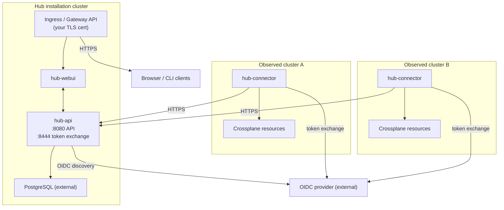

This page explains what a self-hosted Hub installation looks like, what you
provide, and how to choose between the sub-guides.

## Architecture

A self-hosted hub is a single cluster running the hub control plane components
and one or more observed Kubernetes clusters running the `hub-connector`. The
connector pushes the resource state of your clusters to the `hub-api`. You can
configure ingress to allow users to access the `hub-api` or the `hub-webui`. CLI
tools and the hub connector authenticate against the `hub-api` with an
OIDC-style token exchange.

## What you provide

- **A PostgreSQL database.** `hub-api` requires its own database. A managed
  offering (RDS, Cloud SQL, Azure Database for PostgreSQL) or a self-managed
  instance both work. See [the databases overview][overview] for
  the version, extensions, and authentication modes Hub supports.
- **An OIDC provider.** Any OIDC-compliant provider with a discovery endpoint,
  email claim, and configurable group claim works. See [the OIDC
  overview][oidc-configuration] for the contract and the per-provider guides.
- **Ingress with a real TLS certificate.** Provide a Gateway API setup or an
  Ingress controller, plus a CA-signed certificate.
- **DNS.** Pick the hostnames for `hub-api` and `hub-webui`
  (typically `api.<your-domain>` and `ui.<your-domain>`) and create the DNS
  records before install. Hub computes the OIDC redirect URI from them, and it must
  match what the provider has registered.
- **Kubernetes RBAC for connectors.** Each observed cluster needs the
  `hub-connector` ServiceAccount to be able to read the Crossplane resources you
  want Hub to see. The connector chart creates the binding from its own values.
  You confirm the cluster role matches your access policy.

The full pre-flight checklist (versions, sizing, network paths) lives in
[prerequisites][prerequisites]. Read it before you move to the install page.

## What Upbound supports

Upbound tests and supports Hub when its database and supporting infrastructure
run on AWS, GCP, or Azure.
These environments are the only ones covered by Upbound support. Running Hub on any
other cloud provider, on-premises, or in a self-hosted environment is possible
but unsupported. In these configurations you are responsible for provisioning,
operating, and troubleshooting the underlying infrastructure. Upbound may
provide best-effort guidance but doesn't guarantee compatibility, performance,
or issue resolution. Any such deployment is at your own risk.

## What the chart provides

The `hub` umbrella chart at `<chart-ref>` installs three subcharts - `hub-api`,
`hub-webui` and `hub-connector`. `hub-api` is the only chart that's required
for an operational API that can accept resources and serve responses.
`hub-webui` is optional (but recommended) to interact with the system without
using the API directly.

- **`hub-api` Deployment.** The API server, plus a Kubernetes Job that runs
  schema migrations on install and upgrade.
- **`hub-webui` Deployment.** The browser UI. Optional, disable it if you only
  want the API.
- **`hub-connector` Deployment.** You install it once per observed control
  plane, typically as a separate Helm release in each observed cluster. The
  architecture reference describes the
  connector's data and authentication flow
- **Bootstrap configuration.** A Kubernetes Secret rendered from
  `hub-api.bootstrap.files`. Use it to register your initial Hub objects at
  install time. That covers the first `IdentityProvider`, the first
  `ControlPlane`, plus an `OrganizationRoleBinding` linking your OIDC admin
  group to Hub's admin role. The first login then opens at a usable cluster.

## Next step

Work through the section in order:

- [Prerequisites][prerequisites]. The full pre-flight checklist for cluster,
  network, storage, and dependencies.
- [OIDC configuration][oidc-configuration]. Provider contract and per-provider setup.
- [Databases overview][overview]. Postgres requirements and the AWS
  RDS guide.
- [Install][install]. `helm install` against externally managed Postgres and
  OIDC.

Once Hub is serving real traffic, the [production
overview][production-overview] covers sizing, high availability,
autoscaling, RBAC, and upgrades.

[install]: /hub/howtos/install
[oidc-configuration]: /hub/howtos/oidc-configuration
[overview]: /hub/howtos/databases/overview
[prerequisites]: /hub/howtos/prerequisites
[production-overview]: /hub/howtos/production-overview
